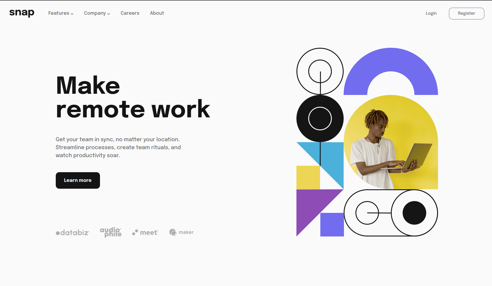
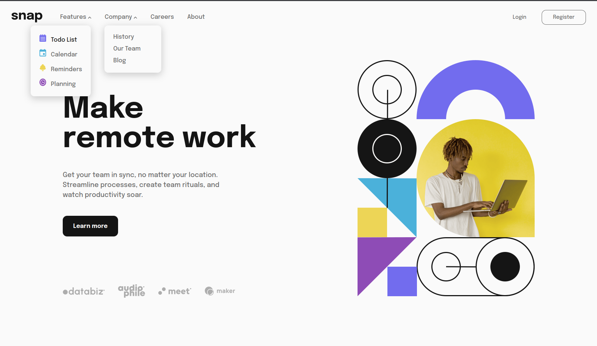
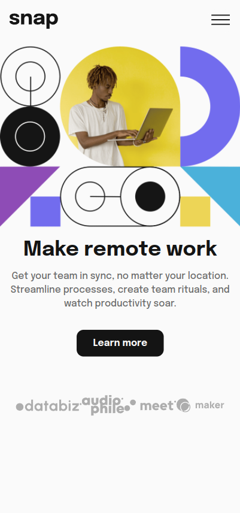
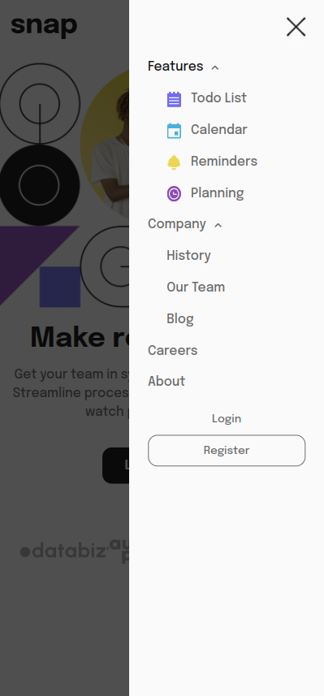

# Frontend Mentor - Intro section with dropdown navigation solution

This is a solution to the [Intro section with dropdown navigation challenge on Frontend Mentor](https://www.frontendmentor.io/challenges/intro-section-with-dropdown-navigation-ryaPetHE5).

## Table of contents

- [Overview](#overview)
  - [The challenge](#the-challenge)
  - [Screenshot](#screenshot)
  - [Links](#links)
- [My process](#my-process)
  - [Built with](#built-with)
  - [What I learned](#what-i-learned)
  - [Continued development](#continued-development)
  - [Useful resources](#useful-resources)
- [Author](#author)
- [Acknowledgments](#acknowledgments)

## Overview

### The challenge

Users should be able to:

- View the relevant dropdown menus on desktop and mobile when interacting with the navigation links
- View the optimal layout for the content depending on their device's screen size
- See hover states for all interactive elements on the page

### Screenshot

### Links

- Solution URL: [Frontendmentor solution](https://www.frontendmentor.io/solutions/responsive-page-made-with-scssflexbox-Ijyo4o054b)
- Live Site URL: [Netlify](https://ns-snapintro.netlify.app)

## My process

### Built with

- Semantic HTML5 markup
- SCSS custom properties
- Flexbox
- Mobile-first workflow

### What I learned

Responsive design aint easy! Mobile-first seems to make the process quicker, as less things seem to break scaling up to desktop mode (as opposed to vice versa).

### Useful resources

- [Sass architecture structure](https://gist.github.com/AdamMarsden/7b85e8d5bdb5bef969a0) - Very handy resource to help with file structure/heirarchy in sass
- [CSS sidebar examples](https://blog.hubspot.com/website/css-sidebar) - Useful resource for building different sidebars with css

## Author

- Website - [Nik Sofianos](nsofianos.github.io)
- Frontend Mentor - [@nsofianos](https://www.frontendmentor.io/profile/nsofianos)
